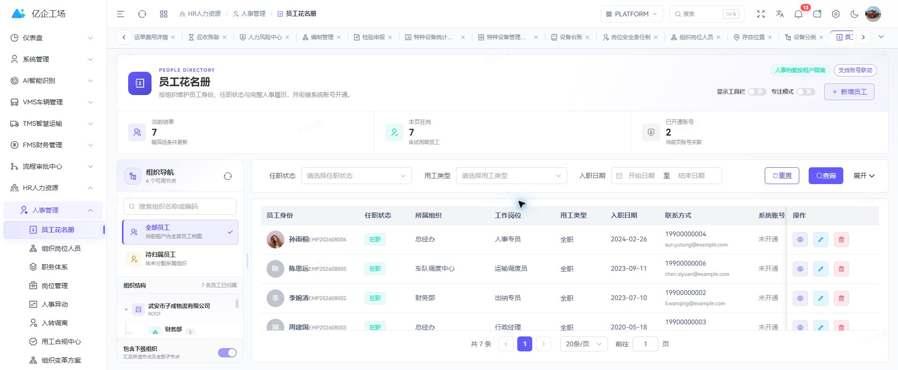

<div align="center">
  <h1>Art Supabase HR</h1>
  <p><strong>覆盖组织、员工全生命周期与人才运营的人力资源应用</strong></p>
  <p>从岗位编制和招聘入职，到考勤薪酬、绩效发展、员工服务与用工风险，沉淀一条连续的人才数据主线。</p>

  <p>
    <a href="https://gitee.com/wangyanghub/art-supabase-hr">Gitee</a>
    ·
    <a href="https://github.com/869123771/art-supabase-hr">GitHub</a>
    ·
    <a href="https://gitee.com/wangyanghub/art-supabase-pro">主平台</a>
    ·
    <a href="https://869123771.github.io/art-supabase-doc/modules/hr">使用文档</a>
  </p>
</div>

## 项目定位

Art Supabase HR 是 Art Supabase Pro 的人力资源业务应用，围绕组织与岗位、员工档案、人才获取、人才发展和日常人事运营建立统一的人力数据与流程体系。

本仓只维护 HR 页面、业务 API、领域类型与适配代码。认证、租户、权限、菜单、布局、路由、公共组件、Store 和 Supabase 公共客户端由 [`art-supabase-pro`](https://gitee.com/wangyanghub/art-supabase-pro) 统一提供。



## 核心能力

| 领域         | 已覆盖能力                                                 |
| ------------ | ---------------------------------------------------------- |
| 组织与岗位   | 组织设计、组织岗位、岗位管理、职务体系、岗位职责与编制规划 |
| 员工生命周期 | 花名册、员工档案、入转调离、人事异动、合同资质与合规记录   |
| 招聘与用工   | 招聘工作台、候选与入职协同、灵活用工、人员供给与用工风险   |
| 日常运营     | 考勤、休假、薪酬、福利、调薪评审、政策签收与员工关系       |
| 人才发展     | 绩效、学习发展、技能矩阵、继任计划、人才盘点与内部流动     |
| 员工体验     | 员工自助、服务交付、体验反馈、人员分析与运营工作台         |

## 人员主线

```text
组织与岗位
  → 编制与招聘
  → 入职与员工档案
  → 考勤 / 薪酬 / 福利 / 服务
  → 绩效 / 学习 / 人才发展
  → 调岗 / 调动 / 离职与历史留痕
```

人员变化通过带生效时间和历史记录的业务流程管理，避免直接覆盖关键履历。其他业务模块只能通过字段最小化的安全契约读取必要人员信息。

## 独立运行

环境要求：Node.js `>= 22.0.0`、pnpm `>= 11.9.0`。

```powershell
pnpm install
pnpm dev
```

默认访问 `http://localhost:3013`。独立运行时，HR 菜单提升为一级入口；由主平台装载时仍保留 HR 应用分组。

```powershell
pnpm check
pnpm build
pnpm preview
```

生产构建输出到 `docs/`，默认公共路径为 `/art-supabase-hr/`，可作为 Pages 发布目录。

## 与主仓协作

HR 业务修改在本仓提交并推送，随后在主仓更新 `modules/art-supabase-hr` 子模块指针。公共能力只在主仓维护；跨模块读取必须经过租户隔离、字段最小化的 API/RPC 契约，HR 敏感字段不向无关业务暴露。

## 安全原则

- 普通员工只能访问本人必要数据；主管、HR 与平台管理员范围由服务端明确区分。
- 身份证件、联系方式、合同、薪酬等敏感字段需要最小化投影与服务端授权。
- 页面权限不能替代数据库 RLS、RPC 校验和完整审计。

## 许可证

本项目采用 [MulanPSL-2.0](LICENSE) 许可证。
