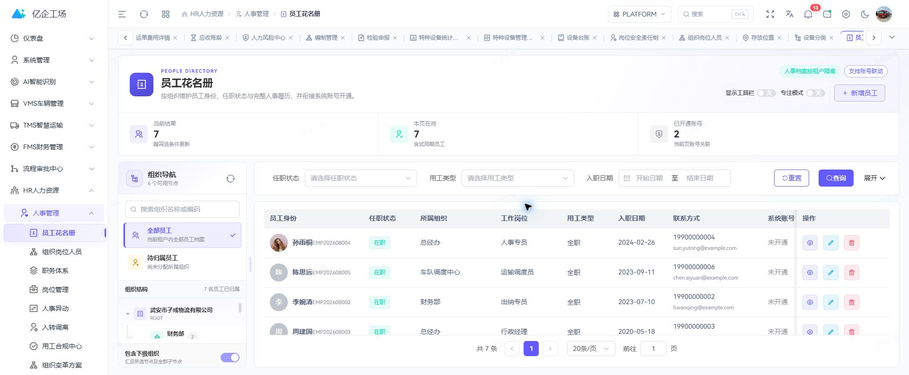

<div align="center">
  <h1>亿企工场 HR</h1>
  <p><strong>覆盖组织、员工全生命周期与人才运营的人力资源应用</strong></p>
  <p>从岗位编制和招聘入职，到考勤薪酬、绩效发展、员工服务与用工风险，沉淀一条连续的人才数据主线。</p>

  <p>
    <a href="https://gitee.com/wangyanghub/art-supabase-hr">Gitee</a>
    ·
    <a href="https://github.com/869123771/art-supabase-hr">GitHub</a>
    ·
    <a href="https://gitee.com/wangyanghub/art-supabase-pro">主平台</a>
    ·
    <a href="https://869123771.github.io/art-supabase-doc/modules/hr">使用文档</a>
  </p>
</div>

## 项目定位

亿企工场 HR 是亿企工场的人力资源业务应用，围绕组织与岗位、员工档案、人才获取、人才发展和日常人事运营建立统一的人力数据与流程体系。

本仓只维护 HR 页面、业务 API、领域类型与适配代码。认证、租户、权限、菜单、布局、路由、公共组件、Store 和 Supabase 公共客户端由 [`art-supabase-pro`](https://gitee.com/wangyanghub/art-supabase-pro) 统一提供。



## 核心能力

| 领域         | 已覆盖能力                                                 |
| ------------ | ---------------------------------------------------------- |
| 组织与岗位   | 组织设计、组织岗位、岗位管理、职务体系、岗位职责与编制规划 |
| 员工生命周期 | 花名册、员工档案、入转调离、人事异动、合同资质与合规记录   |
| 招聘与用工   | 招聘工作台、候选与入职协同、灵活用工、人员供给与用工风险   |
| 日常运营     | 考勤、休假、薪酬、福利、调薪评审、政策签收与员工关系       |
| 人才发展     | 绩效、学习发展、技能矩阵、继任计划、人才盘点与内部流动     |
| 员工体验     | 员工自助、服务交付、体验反馈、人员分析与运营工作台         |

## 人员主线

```text
组织与岗位
  → 编制与招聘
  → 入职与员工档案
  → 考勤 / 薪酬 / 福利 / 服务
  → 绩效 / 学习 / 人才发展
  → 调岗 / 调动 / 离职与历史留痕
```

人员变化通过带生效时间和历史记录的业务流程管理，避免直接覆盖关键履历。其他业务模块只能通过字段最小化的安全契约读取必要人员信息。

## 独立运行

环境要求：Node.js `>= 22.0.0`、pnpm `>= 11.9.0`。

```powershell
pnpm install
pnpm dev
```

默认访问 `http://localhost:3013`。独立运行时，HR 菜单提升为一级入口；由主平台装载时仍保留 HR 应用分组。

```powershell
pnpm check
pnpm build
pnpm preview
```

生产构建输出到 `docs/`，默认公共路径为 `/art-supabase-hr/`，可作为 Pages 发布目录。

## 与主仓协作

HR 业务修改在本仓提交并推送，随后在主仓更新 `modules/art-supabase-hr` 子模块指针。公共能力只在主仓维护；跨模块读取必须经过租户隔离、字段最小化的 API/RPC 契约，HR 敏感字段不向无关业务暴露。

## 安全原则

- 普通员工只能访问本人必要数据；主管、HR 与平台管理员范围由服务端明确区分。
- 身份证件、联系方式、合同、薪酬等敏感字段需要最小化投影与服务端授权。
- 页面权限不能替代数据库 RLS、RPC 校验和完整审计。

## 岗位删除关联核验

岗位删除先通过 `MasterDataDeleteGuard` 检查引用，再进行确认和删除。`public.hr_get_position_delete_dependencies_secure(text[], text)` 在数据库中以受限的 `SECURITY DEFINER` 身份读取跨领域引用；函数先验证登录身份、`Hr:Position:Delete` 权限、每个岗位所属租户与当前读取范围，且只向 `authenticated` 授权执行。平台超级管理员选择“全部租户”时可以核验各租户岗位，普通授权用户只能核验本人可读租户。服务端删除函数仍负责最终权限和并发引用约束。

员工任职引用返回员工 ID 与员工编号，花名册按该 ID 读取并显示目标员工。内部流动申请、招聘交接、有效编制和人力规划明细使用其目标页面可搜索的员工编号、候选人姓名或岗位编码；其他有工作页面的 HR 岗位引用会带关联 ID、编号、来源岗位与返回路径。目标页面只在实际找到关联 ID 时标记“已找到关联记录”，未找到时保留编号和返回入口供人工核对。岗位能力要求目前没有独立维护页面，因此只显示引用详情，不提供失效跳转。

验证口径：在事务内分别以平台超级管理员“全部租户”、平台超级管理员指定租户、普通拥有岗位删除权限的账号、匿名角色调用核验函数；预期为跨租户读取仅对平台超级管理员开放、普通用户跨租户拒绝、匿名无执行权限。浏览器回归覆盖关联阻止删除、员工任职与招聘需求跳转、返回入口、校验失败阻止删除、并发新增引用后复检。

## HR 组织选择契约

业务表单通过 `fetchHrOrganizationTree(feature, { tenantId })` 和 `hrOrganizationTreeField` 展示可搜索、可直接选择父级的组织树。组织名称与编码同时显示；停用组织保留编辑回显但禁止新选入；调整上级时排除当前组织及其后代。

HR 编辑表单使用 `hrTenantScopedFormItems` 移除参与全局范围同步的租户字段，保留记录原租户；显式关联父记录的变更项、控制项、调薪预算、体验行动和服务请求同样保留父级或预设目标租户。组织与业务引用加载使用请求版本和目标租户校验，防止旧响应覆盖当前选项。初始化监听忽略程序预填，保留父记录和历史岗位。

`hr_list_business_organization_options_secure(text, uuid)` 在服务端使用固定业务名单映射页面与查看权限，不依赖员工名册权限。普通用户只读取认证租户，忽略伪造的租户参数与请求头；平台超级管理员遵循全部租户或指定租户读取范围。接口仅向 authenticated 授权执行，不返回员工数量或人员字段。

数据库回归位于主仓 `supabase/tests/hr_organization_options_test.sql`，使用事务回滚验证平台全部、平台指定、仅持招聘业务权限的普通用户、伪造跨租户、未授权业务及匿名请求。2026-10-08 已在项目 `ckbftoopuyophiebamwy` 执行通过，并确认 anon 无执行权限。

2026-10-08 浏览器排查覆盖主仓 `hr-all-pages.spec.ts` 的 30 个 HR 页面（1440px、570px 共 60 项列表检查），并检查新增、编辑、详情、引用删除和错误重试。删除与体验作答 35 项、组织与租户 26 个场景（含修正断言后的复跑）及最后 6 项编辑复核均通过；组织树另覆盖 390px，分析布局覆盖至 2880px。UI 接口夹具用于验证实际组件和写入参数，数据库授权通过上述事务回滚测试单独验证。HR 类型检查、ESLint、全仓 UI 审计和独立浏览器测试构建通过。

## 许可证

本项目采用 [MulanPSL-2.0](LICENSE) 许可证。
